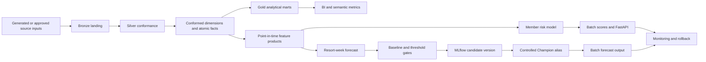

# Hospitality Data and MLOps Reference Platform

[](https://github.com/mrdata355/hospitality-data-mlops-reference-platform/actions/workflows/ci.yml)

**Designed and implemented by:** Kellon Lewis  
**Runtime:** Python 3.10+, Databricks, Delta Lake, MLflow, FastAPI, Kubernetes  
**Release:** 1.1.0  
**Verification date:** July 20, 2026

> **Independent reference implementation.** This repository was independently developed by Kellon Lewis using generated, non-production validation data. It does not contain customer records, credentials, proprietary source-system specifications, or confidential internal architecture, and it does not represent an approved or deployed production system.

## Executive purpose

The platform demonstrates how resort, reservation, member, points, marketing, tour, contract, service, and labor data can be governed through one operating model from source landing to BI products, machine-learning features, registered models, batch scoring, API serving, monitoring, rollback, and incident response.

The implementation is intended to show both hands-on engineering depth and architectural judgment. It includes a deterministic local execution path that can be verified without recurring cloud cost and a parameterized Databricks deployment path that requires approved workspace access, source connections, identities, and environment credentials.

## Six connected projects

This is one flagship platform containing six independently reviewable projects:

1. Lakehouse Foundation
2. Tour and Contract Attribution
3. Member Points and Risk
4. Resort-Week Demand Forecasting
5. Resort Labor Efficiency
6. Production MLOps Control Plane

See [`PROJECTS.md`](PROJECTS.md) for the detailed inventory.

## Verification status

| Capability | Status | Evidence |
|---|---|---|
| Deterministic local data pipeline | Verified | `python scripts/run_all.py` |
| Unit, grain, feature, model, API, and production-asset tests | Verified | `pytest -q` |
| Member-risk model | Verified | ROC AUC 0.811 |
| Resort-week forecast | Verified | WAPE 0.249 vs. 0.265 seasonal baseline |
| FastAPI scoring contract | Verified locally | health, readiness, model metadata, validation, score response |
| Databricks deployment definitions | Included and statically validated | isolated catalogs, runtime parameters, feature build, acceptance gate, alias promotion, scoring, monitoring |
| Managed cloud deployment | Environment-dependent | requires approved cloud resources and credentials |

## Controlled delivery path

1. Source-aligned Bronze ingestion with batch metadata, record hashes, checkpoints, and replay support.
2. Silver conformance with schema enforcement, type normalization, deduplication, referential checks, and quarantine behavior.
3. Conformed dimensions and atomic facts with declared grains.
4. Gold marts for resort performance, campaign attribution, points utilization, and labor efficiency.
5. Point-in-time feature products for member risk and resort-week forecasting.
6. Chronological validation, seasonal-baseline comparison, absolute acceptance thresholds, immutable model versions, and controlled MLflow alias promotion.
7. Batch scoring, optional REST serving, model and data monitoring, retained rollback targets, and operational runbooks.
8. Development, staging, and production isolation through Databricks Asset Bundle variables and environment-specific Unity Catalog catalogs.

## Repository map

```text
src/hospitality_data_platform/ local pipeline, features, models, API, monitoring
sql/databricks/                 parameterized ingestion, MERGE, dimensional, Gold, feature, monitoring SQL
databricks/                     Asset Bundle, environment variables, workflow, promotion, rollback
components/                     ownership and interface documentation for six projects
docs/                           architecture, contracts, SLOs, operations, security, ADRs
data/                           generated validation inputs and outputs
artifacts/                      generated models, metrics, predictions, monitoring, SQLite database
tests/                          pipeline, grain, feature, model, API, and deployment validation
k8s/                            deployment, service, HPA, probes, and resource controls
.github/workflows/              continuous integration gates
```

## Architecture



## Local verification

```bash
python -m venv .venv
source .venv/bin/activate              # Windows: .venv\Scripts\activate
pip install -r requirements.txt
python scripts/run_all.py
pytest -q
```

Start the scoring API:

```bash
make api
```

Endpoints:

```text
GET  /health
GET  /ready
GET  /model-info
POST /score/member-churn
```

## Databricks deployment path

```bash
cd databricks
databricks bundle validate -t dev
databricks bundle deploy -t dev
databricks bundle run hospitality_data_platform_pipeline -t dev
```

Production promotion requires an authorized release owner, workspace policies, managed identities, approved source volumes, and a change record.

## Review documents

- [Project inventory](PROJECTS.md)
- [Executive overview](docs/EXECUTIVE_OVERVIEW.md)
- [Implementation evidence](docs/IMPLEMENTATION_EVIDENCE.md)
- [System design guide](docs/PRODUCTION_SYSTEM_DESIGN.md)
- [Architecture](docs/ARCHITECTURE.md)
- [Data contracts](docs/DATA_CONTRACTS.md)
- [Deployment and release management](docs/DEPLOYMENT.md)
- [Service levels and monitoring](docs/SLO_SLA.md)
- [Operations runbook](docs/OPERATIONS_RUNBOOK.md)
- [Security and governance](docs/SECURITY_GOVERNANCE.md)
- [Production readiness checklist](docs/PRODUCTION_READINESS.md)
