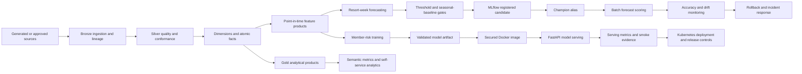

# Hospitality Data and MLOps Reference Platform

[](https://github.com/mrdata355/hospitality-data-mlops-reference-platform/actions/workflows/ci.yml)
[](https://github.com/mrdata355/hospitality-data-mlops-reference-platform/actions/workflows/codeql.yml)

**Maintainer:** Kellon Lewis  
**Core stack:** Python, SQL, Spark, PySpark, Databricks, Delta Lake, Unity Catalog design, MLflow, FastAPI, Docker, Kubernetes  
**Release:** 1.1.0

> **Independent reference implementation.** This repository uses deterministic generated data. It contains no real customer records, production credentials, proprietary source mappings, or confidential internal architecture. It does not represent an approved or deployed production system for any real company.

## Platform scope

The repository implements one connected hospitality data and MLOps platform spanning governed lakehouse processing, reusable point-in-time features, resort-week forecasting, member-risk modeling, analytical products, MLflow lifecycle controls, batch and API scoring, secured container serving, Kubernetes deployment definitions, monitoring, rollback, and incident response.

The system is organized around the technical handoffs between data engineering, feature engineering, data science, analytics, and MLOps.

### Validation and design references

- [Generated sample data and outputs](examples/README.md)
- [System validation walkthrough](docs/SYSTEM_VALIDATION_WALKTHROUGH.md)
- [Serving validation and release controls](docs/SERVING_VALIDATION.md)
- [ML evaluation limitations](docs/ML_EVALUATION_LIMITATIONS.md)
- [Platform capability matrix](docs/CAPABILITY_MATRIX.md)
- [Architecture and implementation overview](docs/TECHNICAL_SHOWCASE.md)
- [Integrated project inventory](PROJECTS.md)

## Verified evidence

| Evidence | Result |
|---|---:|
| Deterministic pipeline | Working credential-free execution path |
| Automated validation | Pipeline, grain, feature, model, API, sample-pack, deployment, security, and serving tests |
| Member-risk model | Synthetic pipeline-validation ROC AUC `0.810+`; not a real-customer performance claim |
| Resort-week forecast | Synthetic chronological WAPE `0.249` |
| Seasonal baseline | Synthetic WAPE `0.265` |
| Source domains | 12 generated operational domains |
| Visible generated samples | 5 source datasets, 3 output datasets, and a validation summary |
| Running-container release gate | Docker image must build, start, become ready, score, expose metrics, and pass security checks |
| Software supply chain | Pinned Python dependencies, dependency audit, CodeQL, provenance, and SBOM |
| Versioned image release | GitHub Container Registry workflow with normalized semantic-version and commit tags |
| Deployment definitions | Databricks and MLflow reference assets plus a runnable baked-model Kubernetes path |

GitHub Actions regenerates the synthetic inputs, builds the data products, creates features, trains and evaluates the models, exports the sample pack, runs tests, audits dependencies, transfers the validated model artifact into a clean serving job, builds the Docker image, runs it with restricted privileges, and executes an end-to-end scoring smoke test. The main CI badge is green only when model validation, software-quality checks, dependency audit, and actual container serving succeed.

## Generated data and outputs

The committed [`examples/`](examples/README.md) directory exposes generated inputs and outputs without requiring the full pipeline to run first.

### Source samples

- members without names, emails, or phone numbers
- reservations with resort, dates, status, room nights, points, and revenue
- points transactions with earning, redemption, expiration, and adjustment activity
- tour events with package, prospect, status, market, and date
- labor shifts with resort-day hours and generated payroll cost

### Output samples

- reusable member-month point-in-time features
- resort-week forecast predictions and errors
- data-quality results
- model metrics, source volumes, drift status, and acceptance gates

The examples are deterministic and synchronized with the pipeline by CI:

```bash
python scripts/run_all.py
python scripts/export_examples.py
```

## Integrated platform domains

| Domain | Business outcome | Core engineering evidence |
|---|---|---|
| **Lakehouse foundation** | Reliable governed data for ML and analytics | Bronze/Silver/Gold, contracts, quality, dimensions, facts, semantic metrics |
| **Tour and contract attribution** | Correct package-to-tour-to-contract conversion reporting | controlled grain, funnel metrics, contract value, ROAS, duplicate prevention |
| **Member points and risk** | Reusable member features and churn-risk scores | point-in-time features, batch scoring, FastAPI inference, synthetic model validation |
| **Resort-week forecasting** | Controlled demand-forecast lifecycle | lag features, chronological validation, baseline gates, MLflow promotion, rollback |
| **Resort labor efficiency** | Staffing and operating-efficiency signals | resort-day model, cost per occupied unit, revenue per labor hour, anomaly flags |
| **MLOps control plane** | Reliable model delivery and operations | CI/CD, registry, aliases, container serving, Kubernetes, monitoring, SLOs, runbooks |

## Architecture



## Platform capability snapshot

| Capability | Repository evidence |
|---|---|
| SQL, Python, Spark, PySpark | Modular local implementation plus parameterized Databricks Spark and SQL workloads |
| Reusable ML features | Member-month and resort-week feature products with declared grains |
| Batch and streaming patterns | Deterministic batch path and Auto Loader streaming-ingestion reference |
| Data modeling | Conformed dimensions, atomic facts, Gold marts, and semantic metrics |
| Data quality | schema, null, uniqueness, FK, grain, missingness, drift, and model gates |
| Feature lineage | source metadata, record hashes, entity keys, event-time cutoffs, and documented contracts |
| Training/inference consistency | shared feature lists, point-in-time rules, API schema validation, and model signatures |
| Feature catalog design | Unity Catalog feature schemas and reusable point-in-time tables |
| Forecast lifecycle | chronological validation, seasonal baseline, MLflow candidate, promotion, scoring, and rollback |
| CI/CD and MLOps | GitHub Actions, artifact handoff, model acceptance, dependency audit, container smoke test, release versioning, and evidence retention |
| Container serving | fixed non-root identity, read-only filesystem, dropped capabilities, readiness, version metadata, score test, and metrics |
| Kubernetes | versioned GHCR image, baked validated model, probes, HPA, PDB, topology spread, NetworkPolicy, workload identity, and resources |
| Azure-oriented deployment path | Databricks targets, AKS patterns, workload-identity metadata, and explicit external-control boundaries |

See [`docs/CAPABILITY_MATRIX.md`](docs/CAPABILITY_MATRIX.md) for the complete implementation index.

## Local validation

The complete local path works without Azure, Databricks, MLflow, Kubernetes, or registry credentials.

```bash
python -m venv .venv
source .venv/bin/activate              # Windows: .venv\Scripts\activate
pip install -r requirements.txt
make validate
make api
```

`make validate` generates all 12 source domains, builds the pipeline, exports the sample pack, trains both models, and runs the complete test suite.

Inspect the direct application process:

```text
http://localhost:8080/docs
http://localhost:8080/health
http://localhost:8080/ready
http://localhost:8080/version
http://localhost:8080/model-info
http://localhost:8080/metrics
```

## Production-style container serving

Generate the local model, build the hardened image, start the service, and execute the same contract test used by CI:

```bash
python scripts/run_all.py
BUILD_SHA=local-test SERVICE_VERSION=1.1.0 docker compose up --build -d
python scripts/smoke_test_serving.py \
  --base-url http://localhost:8080 \
  --evidence artifacts/serving/local-smoke.json
docker compose down
```

The container runs as UID/GID `10001`, with a read-only root filesystem, an in-memory `/tmp`, no Linux capabilities, no privilege escalation, a process limit, and a readiness healthcheck.

## End-to-end delivery path

1. Generate 12 deterministic source domains.
2. Add Bronze source file, batch, ingestion-time, and record-hash metadata.
3. Normalize and deduplicate Silver entities.
4. Enforce schema, null, uniqueness, and foreign-key controls.
5. Build conformed dimensions and atomic facts.
6. Publish Gold resort, campaign, points, labor, and semantic products.
7. Build leakage-safe member-month and resort-week features.
8. Train and validate member-risk and forecasting models.
9. Reject forecast candidates that fail the absolute WAPE or seasonal-baseline gates.
10. Transfer only the validated model artifact into the serving build job.
11. Build an immutable image with service version, source commit, healthcheck, and non-root identity.
12. Run the image with production-style restrictions and verify health, readiness, version, model metadata, scoring, and metrics.
13. Publish versioned multi-architecture images on approved release tags.
14. Deploy the validated baked-model image through Kubernetes rolling updates.
15. Preserve prior model and application versions for independent rollback.

## Feature engineering design

### Member-month feature product

**Grain:** one row per member and as-of month.

Signals include tenure, tier, points earned, redeemed and expired, utilization, stays, room nights, revenue, average booking lead time, service cases, escalations, resolution duration, and booking recency.

### Resort-week feature product

**Grain:** one row per resort and forecast week.

Signals include 1-, 4-, 13-, and 52-week lags, 4- and 13-week rolling means, seasonality, capacity, market, and campaign intensity known at scoring time.

### Consistency controls

- feature windows end before prediction cutoffs
- labels are excluded from feature lists
- model inputs use explicit names and types
- API requests use a validated schema
- local, PySpark, and Spark SQL feature definitions remain aligned
- tests recompute booking lead time directly from Silver stay records
- managed deployment records model signatures and aliases

## MLOps controls

- isolated development, staging, and production catalogs
- Databricks Asset Bundle variables and workflow ordering
- immutable registered model versions
- objective acceptance gates before alias movement
- retained previous version for rollback
- batch-first inference for forecast and broad score refreshes
- FastAPI liveness, readiness, version, model metadata, scoring, request IDs, and metrics
- non-root image with OCI source, version, build date, and commit labels
- CI model-artifact handoff followed by actual restricted-container serving
- pinned Python dependencies, CodeQL, Ruff correctness checks, and dependency audit
- versioned GHCR release workflow with multi-architecture builds, provenance, and SBOM
- Kubernetes rolling deployment, HPA, PDB, topology spreading, workload identity, and NetworkPolicy
- SLOs, incident severity, replay procedures, security guidance, and cost controls

## Repository map

```text
examples/                       compact generated inputs, outputs, metrics, and quality evidence
src/hospitality_data_platform/  local pipeline, features, models, API, monitoring
sql/databricks/                 Spark SQL ingestion, MERGE, dimensions, Gold, features, monitoring
databricks/                     Asset Bundle, workflows, training, promotion, scoring, rollback
components/                     ownership and interface documentation for the integrated domains
docs/                           architecture, contracts, serving validation, SLOs, runbooks, ADRs
tests/                          data, feature, model, API, examples, serving, and deployment validation
k8s/                            versioned deployment, service, autoscaling, disruption and network controls
loadtest/                       representative API load and response-contract validation
.github/                        CI validation, CodeQL, dependency audit, and versioned image release workflows
```

## Managed Databricks path

```bash
cd databricks
databricks bundle validate -t dev
databricks bundle deploy -t dev
databricks bundle run hospitality_data_platform_pipeline -t dev
```

The managed path requires authorized infrastructure, source volumes, identities, Unity Catalog grants, network controls, secrets, and deployment approval.

## Data products and grains

| Data product | Declared grain | Primary use |
|---|---|---|
| `gold.resort_monthly_performance` | resort + month | resort performance |
| `gold.campaign_tour_sales_attribution` | campaign + channel + market + month | marketing and contract conversion |
| `gold.member_points_utilization` | member + month | retention and points engagement |
| `gold.resort_labor_efficiency` | resort + business date | staffing and operating efficiency |
| `features.member_month_features` | member + as-of month | member-risk and propensity models |
| `features.waterfall_resort_week_features` | resort + forecast week | arrivals forecasting |
| `gold.waterfall_forecast_resort_week` | resort + forecast week + run | planning and forecast monitoring |

## Documentation

- [Generated sample data and outputs](examples/README.md)
- [System validation walkthrough](docs/SYSTEM_VALIDATION_WALKTHROUGH.md)
- [Serving validation and release controls](docs/SERVING_VALIDATION.md)
- [ML evaluation limitations](docs/ML_EVALUATION_LIMITATIONS.md)
- [Platform capability matrix](docs/CAPABILITY_MATRIX.md)
- [Architecture and implementation overview](docs/TECHNICAL_SHOWCASE.md)
- [Executive overview](docs/EXECUTIVE_OVERVIEW.md)
- [Implementation evidence](docs/IMPLEMENTATION_EVIDENCE.md)
- [System design](docs/PRODUCTION_SYSTEM_DESIGN.md)
- [Architecture](docs/ARCHITECTURE.md)
- [Data contracts](docs/DATA_CONTRACTS.md)
- [Data dictionary](docs/DATA_DICTIONARY.md)
- [Deployment](docs/DEPLOYMENT.md)
- [SLOs and monitoring](docs/SLO_SLA.md)
- [Operations runbook](docs/OPERATIONS_RUNBOOK.md)
- [Incident response](docs/INCIDENT_RESPONSE.md)
- [Security and governance](docs/SECURITY_GOVERNANCE.md)
- [Cost control](docs/COST_CONTROL.md)
- [Production readiness](docs/PRODUCTION_READINESS.md)
