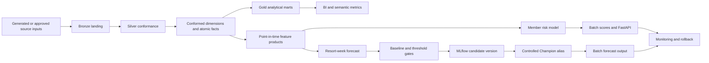

# Hospitality Data and MLOps Reference Platform

[](https://github.com/mrdata355/hospitality-data-mlops-reference-platform/actions/workflows/ci.yml)

**Designed and implemented by:** Kellon Lewis  
**Runtime:** Python 3.10+, Databricks, Delta Lake, MLflow, FastAPI, Kubernetes  
**Release:** 1.1.0  
**Verification date:** July 10, 2026

> **Independent reference implementation.** This repository was independently developed by Kellon Lewis using generated, non-production validation data. It does not contain real customer records, credentials, proprietary source-system specifications, or confidential internal architecture, and it does not represent an approved or deployed production system for any real company. It is a production-style technical demonstration designed for hospitality and vacation-ownership use cases.

## Executive purpose

The platform demonstrates how resort, reservation, member, points, marketing, tour, contract, service, and labor data can be governed through one operating model from source landing to BI products, machine-learning features, registered models, batch scoring, API serving, monitoring, rollback, and incident response.

The implementation is intended to show both hands-on engineering depth and architectural judgment. It includes a deterministic local execution path that can be verified without recurring cloud cost and a parameterized Databricks deployment path that requires approved workspace access, source connections, identities, and environment credentials.

## Six integrated projects

This flagship repository contains six independently reviewable projects: lakehouse foundation, tour and contract attribution, member points and risk, resort-week demand forecasting, resort labor efficiency, and a production MLOps control plane. See [`PROJECTS.md`](PROJECTS.md) for the scope and interview walkthrough of each project.

## Verification status

| Capability | Status | Evidence |
|---|---|---|
| Deterministic local data pipeline | Verified | `python scripts/run_all.py` |
| Unit, grain, feature, model, API, and production-asset tests | Verified | `pytest -q` |
| Member-risk model | Verified | ROC AUC 0.811 |
| Resort-week forecast | Verified | WAPE 0.249 vs. 0.265 seasonal baseline |
| FastAPI scoring contract | Verified locally | health, readiness, model metadata, validation, score response |
| Databricks deployment definitions | Included and statically validated | isolated catalogs, runtime parameters, feature build, acceptance gate, alias promotion, scoring, monitoring |
| Managed cloud deployment | Environment-dependent | requires approved authorized customer cloud resources and credentials |

## Reviewer quick start

A reviewer can validate the credential-free execution path with:

```bash
python -m venv .venv
source .venv/bin/activate              # Windows: .venv\Scripts\activate
pip install -r requirements.txt
make validate
make api
```

Then inspect:

```text
http://localhost:8080/docs
http://localhost:8080/health
http://localhost:8080/ready
http://localhost:8080/model-info
http://localhost:8080/metrics
```

## Repository validation model

The source repository does not commit generated datasets or trained artifacts. GitHub Actions regenerates synthetic inputs, executes the full pipeline, trains and evaluates the models, runs automated tests, and enforces model acceptance thresholds on every pull request. This makes the published evidence reproducible from code rather than dependent on pre-generated outputs.

## Controlled delivery path

1. Source-aligned Bronze ingestion with batch metadata, record hashes, checkpoints, and replay support.
2. Silver conformance with schema enforcement, type normalization, deduplication, referential checks, and quarantine behavior.
3. Conformed dimensions and atomic facts with declared grains.
4. Gold marts for resort performance, campaign attribution, points utilization, and labor efficiency.
5. Point-in-time feature products for member risk and resort-week forecasting.
6. Chronological validation, seasonal-baseline comparison, absolute acceptance thresholds, immutable model versions, and controlled MLflow alias promotion.
7. Batch scoring, optional REST serving, model/data monitoring, retained rollback targets, and operational runbooks.
8. Dev, staging, and production isolation through Databricks Asset Bundle variables and environment-specific Unity Catalog catalogs.

## Repository map

```text
src/hospitality_data_platform/        local pipeline, features, models, API, monitoring
sql/databricks/                       parameterized catalog, ingestion, MERGE, dimensional, Gold, feature, monitoring SQL
databricks/                           Asset Bundle, environment variables, workflow and model promotion code
components/                           component ownership and interface documentation
docs/                                 executive overview, architecture, contracts, SLOs, operations, security, ADRs
data/                                 generated validation inputs and Bronze/Silver/Gold outputs
artifacts/                            models, metrics, predictions, monitoring, SQLite serving database
tests/                                pipeline, grain, feature, model, API, and deployment-asset validation
k8s/                                  deployment, service, HPA, probes, and resource controls
.github/workflows/                    continuous integration gates
```

## Architecture



## Guided setup

Start with [`START_HERE.md`](START_HERE.md), then use [`docs/CREDENTIAL_SETUP.md`](docs/CREDENTIAL_SETUP.md) when approved credentials are available.

## Local verification

The local path runs against generated fixtures and does not require a cloud account.

```bash
python -m venv .venv
source .venv/bin/activate              # Windows: .venv\Scripts\activate
pip install -r requirements.txt
python scripts/run_all.py
pytest -q
```

Start the scoring API:

```bash
make api
```

Endpoints:

```text
GET  /health
GET  /ready
GET  /model-info
GET  /metrics
POST /score/member-churn
```

The service defaults to the packaged local model. A managed deployment can set `MODEL_SOURCE=mlflow` and provide a registered `MODEL_URI` without changing the API contract.

## Databricks deployment path

The bundle defines isolated catalogs for `dev`, `staging`, and `prod`. Every Python workload receives the active catalog at runtime. The forecast workflow builds its own resort-week features, validates the candidate against both an absolute WAPE threshold and a seasonal baseline, records candidate evidence, moves the `Champion` alias only after acceptance, retains the previous alias version as the rollback target, scores the approved model, and writes monitoring results.

```bash
cd databricks
databricks bundle validate -t dev
databricks bundle deploy -t dev
databricks bundle run hospitality_data_platform_pipeline -t dev

databricks bundle validate -t staging
databricks bundle deploy -t staging
databricks bundle run hospitality_data_platform_pipeline -t staging
```

Production promotion additionally requires an authorized release owner, workspace policies, managed identities, approved source volumes, and a change record.

## Data products and grains

| Data product | Declared grain | Primary use |
|---|---|---|
| `gold.resort_monthly_performance` | resort + calendar month | executive resort performance |
| `gold.campaign_tour_sales_attribution` | campaign + channel + market + month | package, tour, and contract attribution |
| `gold.member_points_utilization` | member + calendar month | retention and points engagement |
| `gold.resort_labor_efficiency` | resort + business date | staffing and operating efficiency |
| `features.member_month_features` | member + as-of month | member risk and upgrade models |
| `features.waterfall_resort_week_features` | resort + forecast week | arrivals forecasting |
| `gold.waterfall_forecast_resort_week` | resort + forecast week + run | planning and forecast monitoring |

## Review documents

- [Executive overview](docs/EXECUTIVE_OVERVIEW.md)
- [Implementation evidence](docs/IMPLEMENTATION_EVIDENCE.md)
- [System design guide](docs/PRODUCTION_SYSTEM_DESIGN.md)
- [Architecture](docs/ARCHITECTURE.md)
- [Data contracts](docs/DATA_CONTRACTS.md)
- [Deployment and release management](docs/DEPLOYMENT.md)
- [Service levels and monitoring](docs/SLO_SLA.md)
- [Operations runbook](docs/OPERATIONS_RUNBOOK.md)
- [Incident response](docs/INCIDENT_RESPONSE.md)
- [Security and governance](docs/SECURITY_GOVERNANCE.md)
- [Cost controls](docs/COST_CONTROL.md)
- [Production readiness checklist](docs/PRODUCTION_READINESS.md)
