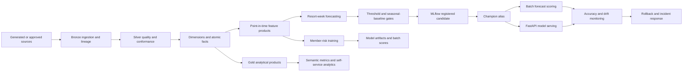

# Hospitality Data and MLOps Reference Platform

[](https://github.com/mrdata355/hospitality-data-mlops-reference-platform/actions/workflows/ci.yml)

**Designed and implemented by:** Kellon Lewis  
**Core stack:** Python, SQL, Spark, PySpark, Databricks, Delta Lake, Unity Catalog design, MLflow, FastAPI, Docker, Kubernetes  
**Release:** 1.1.0

> **Independent reference implementation.** This repository uses deterministic generated data. It contains no real customer records, production credentials, proprietary source mappings, or confidential internal architecture. It does not represent an approved or deployed production system for any real company.

## What this platform demonstrates

One integrated hospitality platform connects governed lakehouse data, reusable point-in-time features, Waterfall-style demand forecasting, member-risk modeling, self-service analytical products, MLflow lifecycle controls, batch and API scoring, Kubernetes deployment definitions, monitoring, rollback, and incident response.

It is designed around the exact handoffs between **data engineering, feature engineering, data science, analytics, and MLOps**.

### Review the showcase

- [Technical showcase](docs/TECHNICAL_SHOWCASE.md)
- [Target-role evidence matrix](docs/JD_ALIGNMENT.md)
- [10–15 minute interview demonstration](docs/INTERVIEW_DEMO.md)
- [Six-project inventory](PROJECTS.md)

## Verified evidence

| Evidence | Result |
|---|---:|
| Deterministic pipeline | Working credential-free execution path |
| Automated validation | Pipeline, grain, feature, model, API, and deployment tests |
| Member-risk model | ROC AUC `0.811` |
| Resort-week forecast | WAPE `0.249` |
| Seasonal baseline | WAPE `0.265` |
| Source domains | 12 generated operational domains |
| Deployment definitions | Databricks, MLflow, Docker, Kubernetes, CI/CD |

GitHub Actions regenerates the synthetic inputs, builds the data products, creates features, trains and evaluates the models, runs tests, and enforces acceptance gates. The repository does not depend on uploaded precomputed results.

## Six integrated production projects

| Project | Business outcome | Core engineering evidence |
|---|---|---|
| **1. Lakehouse Foundation** | Reliable governed data for ML and analytics | Bronze/Silver/Gold, contracts, quality, dimensions, facts, semantic metrics |
| **2. Tour and Contract Attribution** | Correct package-to-tour-to-contract conversion reporting | controlled grain, funnel metrics, contract value, ROAS, duplicate prevention |
| **3. Member Points and Risk** | Reusable member features and churn-risk scores | point-in-time features, batch scoring, FastAPI inference, ROC AUC validation |
| **4. Resort-Week Forecasting** | Productionalized Waterfall-style demand forecast | lag features, chronological validation, baseline gates, MLflow promotion, rollback |
| **5. Resort Labor Efficiency** | Staffing and operating-efficiency signals | resort-day model, cost per occupied unit, revenue per labor hour, anomaly flags |
| **6. MLOps Control Plane** | Reliable model delivery and operations | CI/CD, registry, aliases, batch/API serving, Kubernetes, monitoring, SLOs, runbooks |

## Architecture



## Role-alignment snapshot

| Requirement | Repository evidence |
|---|---|
| SQL, Python, Spark, PySpark | Modular local implementation plus parameterized Databricks Spark and SQL workloads |
| Reusable ML features | Member-month and resort-week feature products with declared grains |
| Batch and streaming | Deterministic batch path and Auto Loader streaming-ingestion reference |
| Data modeling | Conformed dimensions, atomic facts, Gold marts, and semantic metrics |
| Data quality | schema, null, uniqueness, FK, grain, missingness, drift, and model gates |
| Feature lineage | source metadata, record hashes, entity keys, event-time cutoffs, and documented contracts |
| Training/inference consistency | shared feature lists, point-in-time rules, API schema validation, and model signatures |
| Feature Store and catalog | Unity Catalog feature schemas and reusable point-in-time tables |
| Waterfall model | chronological validation, seasonal baseline, MLflow candidate, promotion, scoring, and rollback |
| CI/CD and MLOps | GitHub Actions, model acceptance, versioning, deployment definitions, monitoring, and runbooks |
| Kubernetes | non-root container, probes, HPA, PDB, topology spread, NetworkPolicy, and resources |
| Azure readiness | Databricks targets, AKS patterns, workload-identity placeholder, and secret boundaries |

## Reviewer quick start

The complete local path works without Azure, Databricks, MLflow, or Kubernetes credentials.

```bash
python -m venv .venv
source .venv/bin/activate              # Windows: .venv\Scripts\activate
pip install -r requirements.txt
make validate
make api
```

Inspect:

```text
http://localhost:8080/docs
http://localhost:8080/health
http://localhost:8080/ready
http://localhost:8080/model-info
http://localhost:8080/metrics
```

## End-to-end delivery path

1. Generate 12 deterministic source domains.
2. Add Bronze source file, batch, ingestion-time, and record-hash metadata.
3. Normalize and deduplicate Silver entities.
4. Enforce schema, null, uniqueness, and foreign-key controls.
5. Build conformed dimensions and atomic facts.
6. Publish Gold resort, campaign, points, labor, and semantic products.
7. Build leakage-safe member-month and resort-week features.
8. Train and validate member-risk and forecasting models.
9. Reject forecast candidates that fail the absolute WAPE or seasonal-baseline gates.
10. Register and promote accepted model versions through a controlled alias.
11. Publish batch predictions and expose optional synchronous scoring.
12. Monitor drift, accuracy, bias, score distribution, API errors, and latency.
13. Preserve the prior validated model and serving output for rollback.

## Feature engineering design

### Member-month feature product

**Grain:** one row per member and as-of month.

Signals include tenure, tier, points earned, redeemed and expired, utilization, stays, room nights, revenue, service cases, escalations, resolution duration, and booking recency.

### Resort-week feature product

**Grain:** one row per resort and forecast week.

Signals include 1-, 4-, 13-, and 52-week lags, 4- and 13-week rolling means, seasonality, capacity, market, and campaign intensity known at scoring time.

### Consistency controls

- feature windows end before prediction cutoffs
- labels are excluded from feature lists
- model inputs use explicit names and types
- API requests use a validated schema
- managed deployment records model signatures and aliases
- tests verify grain and missing lag behavior

## Production MLOps controls

- isolated development, staging, and production catalogs
- Databricks Asset Bundle variables and workflow ordering
- immutable registered model versions
- objective acceptance gates before alias movement
- retained previous version for rollback
- batch-first inference for forecast and broad score refreshes
- FastAPI liveness, readiness, model metadata, scoring, and metrics
- non-root Docker runtime
- Kubernetes rolling deployment, HPA, PDB, topology spreading, and NetworkPolicy
- SLOs, incident severity, replay procedures, security guidance, and cost controls

## Repository map

```text
src/hospitality_data_platform/  local pipeline, features, models, API, monitoring
sql/databricks/                 Spark SQL ingestion, MERGE, dimensions, Gold, features, monitoring
databricks/                     Asset Bundle, workflows, training, promotion, scoring, rollback
components/                     ownership and interface documentation for the six projects
docs/                           showcase, JD evidence, architecture, contracts, SLOs, runbooks, ADRs
tests/                          data, feature, model, API, and deployment-asset validation
k8s/                            deployment, service, autoscaling, disruption and network controls
loadtest/                       representative API load and response-contract validation
.github/                        CI/CD and repository release controls
```

## Managed Databricks path

```bash
cd databricks
databricks bundle validate -t dev
databricks bundle deploy -t dev
databricks bundle run hospitality_data_platform_pipeline -t dev
```

The managed path requires authorized infrastructure, source volumes, identities, Unity Catalog grants, network controls, secrets, and deployment approval.

## Data products and grains

| Data product | Declared grain | Primary use |
|---|---|---|
| `gold.resort_monthly_performance` | resort + month | resort performance |
| `gold.campaign_tour_sales_attribution` | campaign + channel + market + month | marketing and contract conversion |
| `gold.member_points_utilization` | member + month | retention and points engagement |
| `gold.resort_labor_efficiency` | resort + business date | staffing and operating efficiency |
| `features.member_month_features` | member + as-of month | member-risk and propensity models |
| `features.waterfall_resort_week_features` | resort + forecast week | arrivals forecasting |
| `gold.waterfall_forecast_resort_week` | resort + forecast week + run | planning and forecast monitoring |

## Documentation

- [Technical showcase](docs/TECHNICAL_SHOWCASE.md)
- [JD alignment](docs/JD_ALIGNMENT.md)
- [Interview demonstration](docs/INTERVIEW_DEMO.md)
- [Executive overview](docs/EXECUTIVE_OVERVIEW.md)
- [Implementation evidence](docs/IMPLEMENTATION_EVIDENCE.md)
- [System design](docs/PRODUCTION_SYSTEM_DESIGN.md)
- [Architecture](docs/ARCHITECTURE.md)
- [Data contracts](docs/DATA_CONTRACTS.md)
- [Data dictionary](docs/DATA_DICTIONARY.md)
- [Deployment](docs/DEPLOYMENT.md)
- [SLOs and monitoring](docs/SLO_SLA.md)
- [Operations runbook](docs/OPERATIONS_RUNBOOK.md)
- [Incident response](docs/INCIDENT_RESPONSE.md)
- [Security and governance](docs/SECURITY_GOVERNANCE.md)
- [Cost control](docs/COST_CONTROL.md)
- [Production readiness](docs/PRODUCTION_READINESS.md)
