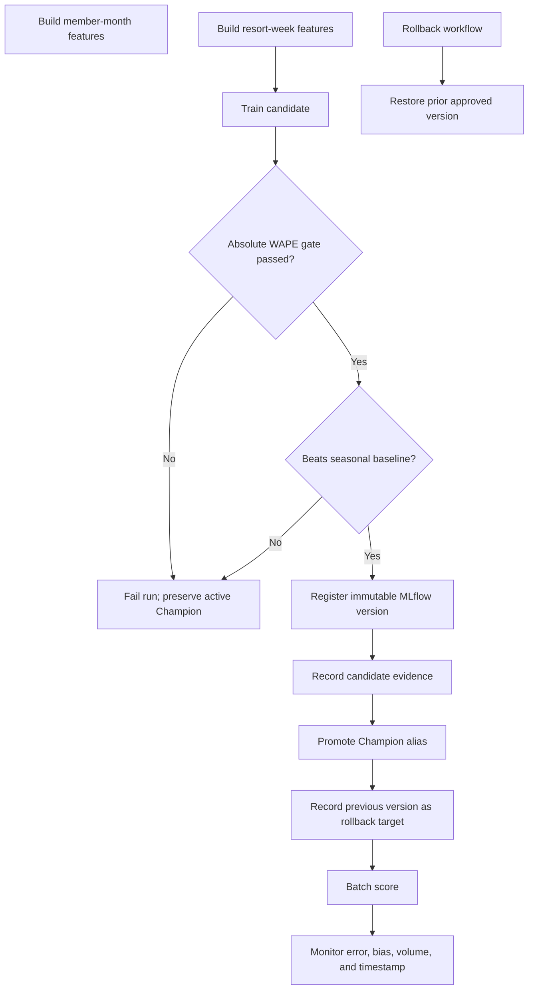

# Databricks Deployment and MLOps Assets

This directory contains the managed-platform implementation for environment isolation, reusable feature pipelines, Waterfall-style model training, MLflow registration and promotion, batch scoring, monitoring, and controlled rollback.

The local repository remains credential-free. These assets become executable only after an approved Databricks workspace, identity, Unity Catalog permissions, source volumes, network controls, and secrets are configured.

## Directory map

| Path | Responsibility |
|---|---|
| `databricks.yml` | Asset Bundle name, variables, runtime versions, compute defaults, and environment targets |
| `resources/jobs.yml` | ordered feature, training, promotion, scoring, and monitoring workflow |
| `resources/rollback.yml` | independent operational workflow for restoring a prior model version |
| `src_databricks/common.py` | runtime argument parsing and environment-safe table resolution |
| `src_databricks/build_member_features.py` | reusable point-in-time member feature pipeline |
| `src_databricks/build_waterfall_features.py` | resort-week lag and rolling feature pipeline |
| `src_databricks/train_waterfall.py` | chronological training, metrics, acceptance gates, and candidate registration |
| `src_databricks/promote_waterfall.py` | controlled MLflow alias promotion and rollback-target recording |
| `src_databricks/batch_score.py` | alias-based distributed batch inference |
| `src_databricks/monitor.py` | forecast accuracy, bias, row-count, and operational evidence |
| `src_databricks/rollback_waterfall.py` | restores the latest approved rollback target or an explicit version |

## Workflow dependency graph



## Environment targets

| Target | Mode | Catalog | Intended use |
|---|---|---|---|
| `dev` | development | `hospitality_data_platform_dev` | engineering integration and generated data |
| `staging` | production-mode bundle | `hospitality_data_platform_staging` | production-like validation and approval evidence |
| `prod` | production-mode bundle | `hospitality_data_platform` | authorized enterprise execution only |

The active catalog is passed to every workload at runtime. Source code does not need environment-specific table edits.

## Model acceptance and promotion

The Waterfall workflow uses chronological validation rather than a random split. A candidate is accepted only when:

```text
validation WAPE <= configured maximum WAPE
AND
validation WAPE <= 52-week seasonal baseline WAPE
```

A rejected candidate:

- is still traceable through its run and metrics
- does not move the active `Champion` alias
- does not replace the current production scoring version
- fails the workflow before dependent scoring tasks run

An accepted candidate:

- is registered as an immutable MLflow model version
- records run ID, validation cutoff, MAE, WAPE, baseline WAPE, and acceptance status
- is promoted through the controlled `Champion` alias
- records the previous version as the rollback target

## Training and inference consistency

- Feature names are explicit and version-controlled.
- Feature pipelines use declared entity and time grains.
- Batch scoring loads the approved MLflow alias rather than a mutable local path.
- The same feature columns are used by training and scoring.
- Managed model signatures record input and prediction schemas.
- The API path preserves a compatible feature contract for synchronous scoring.

## Deployment commands

```bash
cd databricks

# Development
databricks bundle validate -t dev
databricks bundle deploy -t dev
databricks bundle run hospitality_data_platform_pipeline -t dev

# Staging
databricks bundle validate -t staging
databricks bundle deploy -t staging
databricks bundle run hospitality_data_platform_pipeline -t staging
```

Production deployment should occur only after staging evidence, security review, data-owner approval, cluster policy assignment, alert configuration, rollback confirmation, and a recorded change window.

## Rollback

```bash
databricks bundle run hospitality_data_platform_model_rollback -t staging
```

The rollback task:

1. resolves the most recent recorded rollback target unless an explicit version is provided
2. moves the `Champion` alias to that version
3. tags the restored version with a rollback timestamp
4. records the from-version, to-version, alias, and completion time
5. supports a post-rollback smoke score and monitoring check

## Required credentials and permissions

No credentials are committed. A managed deployment typically requires:

- Databricks workspace authentication
- service principal or workload identity
- Unity Catalog catalog and schema permissions
- approved volume access
- MLflow registered-model permissions
- cluster policy permission
- secret-scope or Key Vault integration

See [`../docs/CREDENTIAL_SETUP.md`](../docs/CREDENTIAL_SETUP.md) and [`../docs/DEPLOYMENT.md`](../docs/DEPLOYMENT.md).

## Target-role evidence

This directory demonstrates end-to-end ML pipeline delivery, Databricks orchestration, PySpark feature engineering, MLflow lifecycle management, reproducibility, batch deployment, monitoring, release approval boundaries, and rollback.
