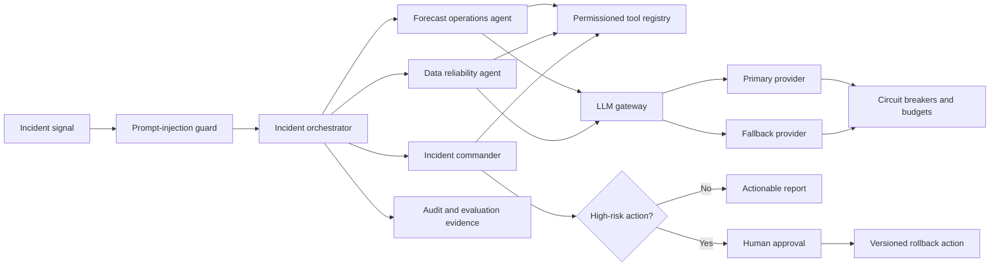

# Hospitality AI Operations Control Plane

## Purpose

Version 2 adds a policy-governed AI operations layer to the hospitality data and MLOps platform. It is designed to investigate data, model, and serving incidents without allowing an agent to bypass data policy, tool authorization, budget controls, audit logging, or human approval.

The credential-free path is deterministic so CI can validate the complete control plane without external model keys. Production providers can be added behind the same gateway contract.

## Architecture



## Implemented controls

| Control | Evidence |
|---|---|
| Provider abstraction | Configured model, capability, classification, cost, latency, and priority policy |
| Provider failover | Injected primary failure routes to the approved fallback provider |
| Circuit breaker | Failed provider opens its circuit and is excluded until cooldown |
| Cost governance | Per-workflow budget ledger and per-request cost ceiling |
| Data governance | Classification-aware routing and sensitive metadata redaction |
| Prompt security | Untrusted instruction patterns are rejected before orchestration |
| Tool authorization | Every tool declares allowed agent roles and action risk |
| Human approval | Rollback cannot execute without a named approver |
| Grounding | Agent findings cite tool evidence rather than unverified free-form context |
| Auditability | Provider calls, incidents, approvals, routes, costs, and outcomes are retained |
| Evaluation | Deterministic tests measure failover, grounding, authorization, approval, injection blocking, and budget enforcement |

## Specialized agents

### Forecast Operations Analyst

Reads forecast acceptance metrics, model registry state, lineage, and the approved forecast runbook. It freezes failed candidates and recommends replay and validation steps.

### Data Reliability Investigator

Reads freshness, duplicate, contract, and lineage evidence. It identifies the first failed contract and the affected downstream products.

### Incident Commander

Assigns severity, consolidates evidence, selects the approved runbook, and proposes high-risk actions. It cannot execute rollback without explicit human approval.

## API

Run the AI operations service separately from the member-risk scoring service:

```bash
make ai-ops-api
```

Endpoints:

```text
GET  /health
GET  /providers
GET  /tools
POST /incidents/analyze
GET  /incidents/{report_id}
POST /incidents/{report_id}/approve
```

## Deterministic system demo

```bash
make ai-ops-demo
```

The demo:

1. Injects a resort-week forecast degradation.
2. Shows a reservation freshness SLO breach.
3. Injects failure into the primary provider.
4. Opens the primary circuit and uses the approved fallback.
5. Grounds findings in forecast, quality, lineage, registry, and runbook tools.
6. Produces a `SEV2` report.
7. Blocks model rollback until a human approver is supplied.
8. Writes incident and evaluation evidence under `artifacts/ai_ops/`.

## Validation

```bash
make ai-ops-test
make ai-ops-demo
```

The evaluation suite must report a `scenario_pass_rate` of `1.0` for the credential-free reference path.

## Production extension points

- Replace deterministic providers with approved cloud or private model adapters.
- Persist audit events and incident reports to governed storage.
- Integrate enterprise identity and role claims for approval.
- Bind tools to actual Databricks jobs, MLflow aliases, Kubernetes revisions, and observability APIs.
- Require signed action requests and dual approval for production rollback.
- Export gateway and agent metrics to the existing monitoring stack.
