# Serving Validation and Release Controls

## Purpose

This document defines how the member-risk scoring service is built, executed, validated, released, and prepared for Kubernetes deployment without requiring user-supplied cloud credentials during pull-request validation.

The repository now treats serving as a required release gate. A change is not considered validated merely because unit tests pass; GitHub Actions must build the container, run it with restricted privileges, wait for model readiness, submit a representative scoring request, verify metrics and version metadata, and preserve machine-readable evidence.

## CI serving path

```mermaid
flowchart LR
    A[Generate synthetic sources] --> B[Build features and models]
    B --> C[Run automated tests and model gates]
    C --> D[Upload validated model artifact]
    D --> E[Build immutable Docker image]
    E --> F[Verify non-root user, healthcheck, and OCI labels]
    F --> G[Run read-only restricted container]
    G --> H[Readiness and health checks]
    H --> I[Version and model metadata checks]
    I --> J[Representative scoring request]
    J --> K[Prometheus-format metrics check]
    K --> L[Upload serving evidence]
```



## Runtime contract

| Endpoint | Role | Required behavior |
|---|---|---|
| `GET /health` | process liveness | returns service identity, version, build SHA, environment, and `status=ok` |
| `GET /ready` | traffic readiness | loads the configured model and returns `503` when no approved artifact is available |
| `GET /version` | release traceability | exposes service version, build SHA, environment, and active model alias |
| `GET /model-info` | model contract inspection | exposes model source, artifact, load time, feature names, version, and build SHA |
| `GET /metrics` | observability | exposes request, error, latency, and build information metrics |
| `POST /score/member-churn` | synchronous inference | validates the feature schema and returns probability, risk band, model alias, timestamp, and request ID |

## Container security controls

The image and CI runtime enforce:

- fixed non-root UID and GID `10001`
- read-only root filesystem
- writable `/tmp` only through an in-memory temporary filesystem
- all Linux capabilities dropped
- privilege escalation disabled
- process-count limit
- built-in readiness healthcheck
- immutable service version and source commit labels
- no customer data, credentials, or cloud configuration embedded in the image

The same controls are represented in Docker Compose and Kubernetes manifests.

## Reproduce locally

Generate the model artifact and start the secured container:

```bash
python scripts/run_all.py
BUILD_SHA=local-test SERVICE_VERSION=1.1.0 docker compose up --build -d
python scripts/smoke_test_serving.py \
  --base-url http://localhost:8080 \
  --evidence artifacts/serving/local-smoke.json
```

Inspect runtime state:

```bash
docker compose ps
docker compose logs member-risk-api
curl http://localhost:8080/version
curl http://localhost:8080/model-info
curl http://localhost:8080/metrics
```

Stop the service:

```bash
docker compose down
```

## CI evidence

The `platform-ci` workflow produces three short-retention artifacts:

1. `validated-member-risk-model`
2. `validation-evidence`
3. `serving-evidence`

`serving-evidence` includes:

- endpoint results and latencies from the smoke test
- score response contract evidence
- container inspection metadata
- application logs

The CI badge is green only when both the data/model validation job and the running-container serving job succeed.

## Versioned image release

The `release-image` workflow runs on semantic version tags or manual dispatch. It:

1. rebuilds the deterministic model artifact
2. executes automated tests
3. authenticates to GitHub Container Registry with the repository-provided `GITHUB_TOKEN`
4. builds `linux/amd64` and `linux/arm64` images
5. publishes immutable tag and commit-SHA references
6. emits build provenance and an SBOM

No personal access token or committed registry password is required.

## Kubernetes deployment preparation

The `k8s/kustomization.yaml` file assembles the service account, Deployment, Service, HPA, PodDisruptionBudget, and NetworkPolicy.

The production-style Deployment references the versioned GitHub Container Registry image and includes:

- three baseline replicas
- zero-unavailable rolling updates
- startup, readiness, and liveness probes
- CPU and memory requests and limits
- zone and node topology spreading
- non-root execution and read-only filesystem
- workload-identity integration point
- graceful pre-stop behavior
- HPA scaling and disruption protection

Before an authorized deployment, the release owner must replace the workload-identity client ID, create the model URI secret through the target platform, verify registry access, and preferably pin the image by digest.

## Deployment boundary

This repository proves that the application can be built and served as a restricted container in automated CI without external credentials. It also contains versioned release automation and Kubernetes deployment definitions.

It does not claim that the service is currently deployed inside a real company's Azure, Databricks, MLflow, or AKS environment. That final stage requires approved identities, networking, source contracts, registry permissions, monitoring destinations, load evidence, and operational sign-off.
