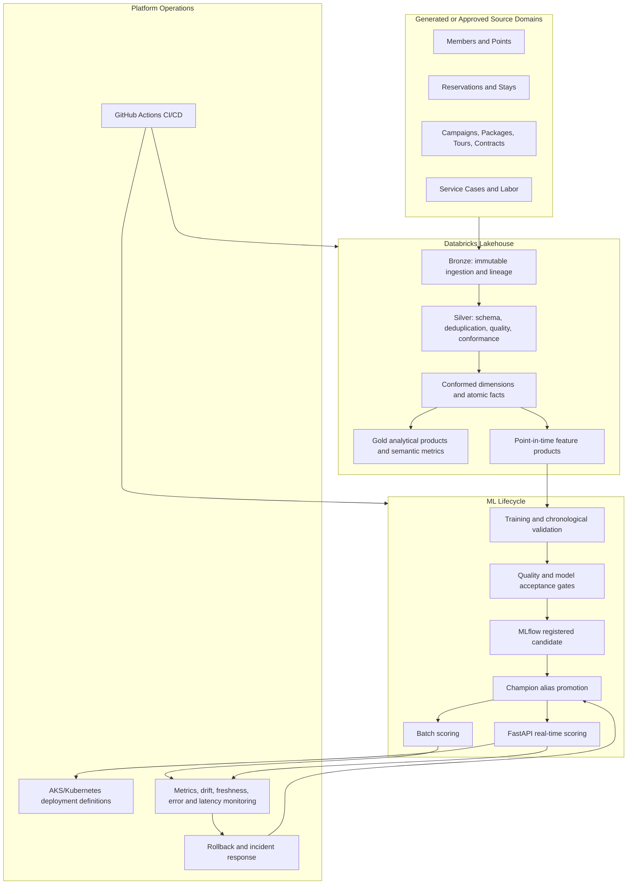
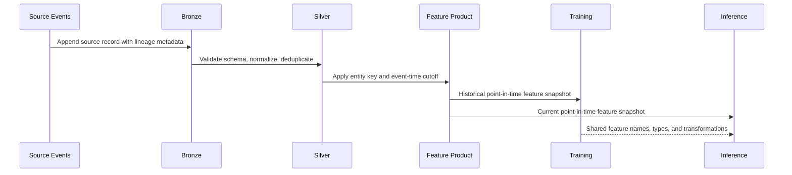

# Technical Showcase

## Hospitality Feature Engineering and MLOps Platform

**Designed and implemented by Kellon Lewis**

This document presents the repository as one integrated production-style platform containing six connected projects. The implementation uses deterministic synthetic data so reviewers can execute the complete local workflow without company data, Azure credentials, Databricks credentials, or Kubernetes access.

## Executive value proposition

The platform addresses four common constraints in enterprise machine-learning delivery:

1. Data scientists repeatedly rebuild the same features in notebooks.
2. Training and inference pipelines calculate features differently.
3. Models reach validation but lack controlled promotion, monitoring, and rollback.
4. Business teams depend on engineers for every new KPI or analytical view.

The repository responds with governed source processing, dimensional models, reusable point-in-time features, a Waterfall-style forecasting workflow, a member-risk model, certified analytical products, CI/CD, MLflow lifecycle controls, and scalable API deployment definitions.

## Architecture



## Six connected projects

### 1. Lakehouse Foundation

**Business problem:** Raw operational data cannot support reliable ML or self-service analytics until grain, keys, quality, and ownership are standardized.

**Implementation:**

- deterministic generation across 12 hospitality source domains
- replay-oriented Bronze ingestion metadata and record hashing
- Silver type normalization and latest-record deduplication
- schema, null, uniqueness, and referential-integrity checks
- conformed member, resort, campaign, and date dimensions
- atomic reservation, stay, points, tour, contract, service, labor, and marketing facts
- Gold business products and governed semantic metrics

**Principal-level design choice:** Aggregation occurs only after atomic fact grain is stable. This prevents duplicate multiplication and ensures features, dashboards, and models use the same business definitions.

### 2. Tour and Contract Attribution

**Business problem:** Multiple marketing touches, tour status events, and contract records can inflate conversion metrics when joined directly.

**Implementation:**

- package and prospect grain established before campaign aggregation
- tour scheduled, tour shown, signed contract, contract value, conversion, and ROAS metrics
- controlled joins that prevent many-to-many duplication
- certified Gold product for marketing and sales analysis

**Principal-level design choice:** Each funnel stage is reduced to its declared business grain before joining. Metric correctness is prioritized over convenient but unsafe wide joins.

### 3. Member Points and Risk

**Business problem:** Member-risk models need reusable behavioral features that are consistent, explainable, and safe from future-data leakage.

**Implementation:**

- member and as-of-month feature grain
- tenure, tier, home market, points earned, redeemed, and expired
- utilization, expired share, stays, room nights, booking recency, service cases, and escalations
- point-in-time cutoff rules that exclude events occurring after the prediction date
- reproducible scikit-learn pipeline
- batch score output and FastAPI scoring contract

**Verified evidence:** Member-risk ROC AUC of `0.811` on the deterministic holdout.

### 4. Resort-Week Demand Forecasting

**Business problem:** Forecasting must outperform a credible baseline and operate as a controlled production workflow rather than an isolated notebook.

**Implementation:**

- resort and forecast-week feature grain
- 1-, 4-, 13-, and 52-week lag features
- 4- and 13-week rolling means
- calendar seasonality, resort capacity, market, and campaign intensity
- chronological validation rather than random splitting
- absolute WAPE threshold and 52-week seasonal-baseline comparison
- candidate evidence table, MLflow registration, controlled alias promotion, scoring, accuracy monitoring, and rollback

**Verified evidence:** Forecast WAPE of `0.249` compared with a `0.265` seasonal baseline.

### 5. Resort Labor Efficiency

**Business problem:** Resort operators need staffing signals that align labor cost with actual demand and revenue.

**Implementation:**

- resort and business-date grain
- arrivals, occupied unit nights, room revenue, labor hours, and payroll cost
- payroll cost per occupied unit and revenue per labor hour
- resort-relative anomaly flag using the historical 95th percentile

**Principal-level design choice:** Demand remains the driving table, and missing labor data is exposed instead of silently removing affected resort-days.

### 6. Production MLOps Control Plane

**Business problem:** Valid models still fail in production when delivery, promotion, observability, and rollback controls are missing.

**Implementation:**

- pull-request CI running generation, pipelines, tests, and model gates
- Databricks Asset Bundle targets for development, staging, and production
- runtime catalog injection instead of hard-coded environment paths
- immutable MLflow model versions and controlled `Champion` alias movement
- previous-version rollback evidence and dedicated rollback workflow
- FastAPI liveness, readiness, model information, scoring, request IDs, and metrics
- non-root Docker image and Kubernetes Deployment, HPA, PDB, NetworkPolicy, probes, resources, and topology spreading
- SLOs, incident severity, replay procedures, security controls, and cost controls

## Feature engineering operating model



### Training and inference consistency

The platform controls consistency through:

- explicit feature lists in model code
- declared entity and as-of grains
- shared feature names and types
- event-time filtering before aggregation
- API payload validation through Pydantic
- model signatures and registered model aliases in the managed deployment path
- automated tests that verify feature grain and prevent target-label inclusion

## Data quality and observability

| Control | Failure detected | System response |
|---|---|---|
| Required columns | Missing contract field | Stop publication |
| Unique business key | Duplicate entity or transaction | Fail Silver quality gate |
| Referential integrity | Reservation references unknown member or resort | Fail or quarantine |
| Feature grain | Duplicate member-month or resort-week | Fail automated test |
| Missing lag features | Incomplete forecasting history | Exclude invalid rows and fail tests if nulls remain |
| Feature drift | Distribution shift in booking recency | Record PSI and warning status |
| Forecast accuracy | WAPE degradation | Alert, investigate, retrain, or roll back |
| Service readiness | Model artifact unavailable | Return 503 and remove pod from traffic |
| Model acceptance | Candidate fails threshold or baseline | Preserve active alias |

## JD alignment summary

| Role requirement | Repository evidence |
|---|---|
| SQL | Parameterized Databricks SQL for catalogs, MERGE, dimensions, facts, Gold products, features, and monitoring |
| Python | Modular generation, pipeline, features, models, monitoring, API, and tests |
| Spark and PySpark | Databricks feature workloads, Auto Loader reference, Spark windows, joins, and Delta publication |
| Databricks | Asset Bundles, isolated catalogs, workflows, Unity Catalog object design, and MLflow integration |
| Reusable ML features | Member-month and resort-week feature products with declared contracts |
| Batch and streaming | Deterministic batch path plus Auto Loader available-now streaming ingestion pattern |
| Data modeling | Conformed dimensions, atomic facts, Gold marts, and semantic metrics |
| Data quality | Schema, null, uniqueness, foreign-key, grain, missingness, drift, and model gates |
| Feature lineage | Source metadata, declared feature inputs, as-of cutoffs, and Unity Catalog target design |
| Training/inference consistency | Shared feature lists, type contracts, model signatures, and API validation |
| MLflow | Candidate logging, registered versions, aliases, promotion evidence, and rollback |
| Kubernetes | Non-root container, probes, HPA, PDB, topology spread, resources, and NetworkPolicy |
| CI/CD | Pull-request pipeline execution, tests, model gates, and release-asset verification |
| Monitoring | Forecast error, bias, PSI, score distribution, API metrics, freshness, and SLO definitions |
| Azure readiness | AKS patterns, managed identity placeholders, Azure-oriented Databricks configuration, and secret boundaries |

## Validation evidence

The credential-free workflow executes:

```text
Generate 12 synthetic source domains
  → Build Bronze
  → Build and validate Silver
  → Build dimensions and facts
  → Build Gold products
  → Build member and forecasting features
  → Train and evaluate two models
  → Publish predictions and monitoring results
  → Start and test the scoring API
```

GitHub Actions enforces:

- Python compilation
- deterministic pipeline completion
- unit and integration tests
- feature-grain and leakage checks
- model acceptance thresholds
- deployment-asset presence and configuration checks

## Principal engineering decisions and tradeoffs

| Decision | Why it was selected | Tradeoff |
|---|---|---|
| Credential-free deterministic local path | Makes the repository immediately reviewable and reproducible | Does not prove live enterprise infrastructure |
| Batch-first scoring | Lower cost, simple replay, strong auditability | Not suitable for every low-latency use case |
| Champion alias promotion | Decouples model version from consuming systems | Requires registry governance |
| Last-successful publication | Prevents invalid data from replacing validated outputs | Consumers may receive stale but valid data during incidents |
| Chronological forecast validation | Reflects real forecasting behavior | Produces fewer training rows than random validation |
| Synthetic data in public source | Protects privacy and corporate information | Real production scale and source quirks require authorized testing |
| Separate environment catalogs | Limits accidental cross-environment writes | Requires identity and access administration |

## Five-minute reviewer path

1. Read the root `README.md` and `PROJECTS.md`.
2. Review `src/hospitality_data_platform/features.py` for point-in-time features.
3. Review `databricks/src_databricks/train_waterfall.py` and `promote_waterfall.py` for model gates.
4. Review `.github/workflows/ci.yml` for reproducibility.
5. Review `k8s/` and `docs/OPERATIONS_RUNBOOK.md` for production controls.

## Honest deployment boundary

The local execution path is working and validated without credentials. The Databricks, Unity Catalog, MLflow, Azure, and Kubernetes assets demonstrate deployable architecture and operational controls. They should not be described as a live company production deployment until tested in an authorized environment with real identities, network controls, source contracts, production-like volumes, and operational sign-off.
