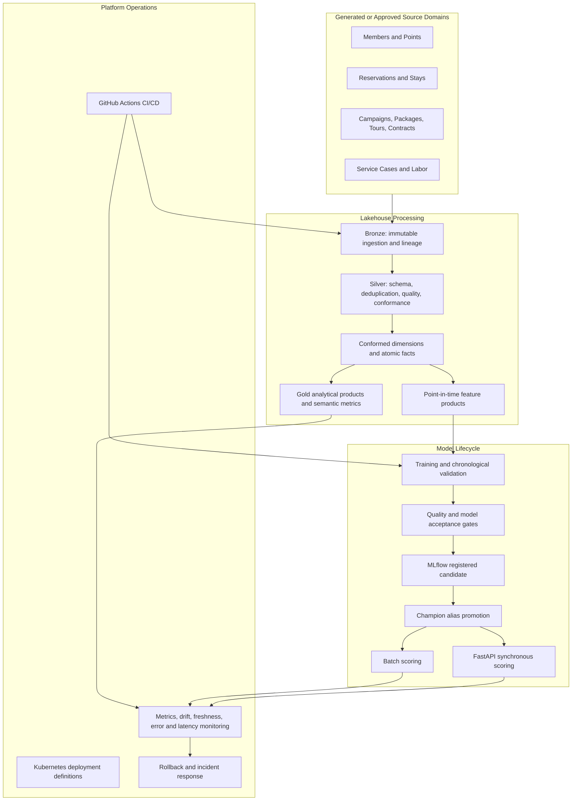

# Technical Architecture and Implementation Overview

## Platform purpose

This document summarizes the repository as one integrated production-style hospitality data and MLOps platform. The implementation uses deterministic synthetic data so the complete local workflow can be executed without company data, Azure credentials, Databricks credentials, or Kubernetes access.

The platform addresses four recurring machine-learning delivery problems:

1. Feature logic is repeatedly rebuilt in isolated notebooks.
2. Training and inference paths calculate signals differently.
3. Models reach validation without controlled promotion, monitoring, or rollback.
4. Business metrics are recreated independently across engineering and analytics workflows.

The repository responds with governed source processing, dimensional models, reusable point-in-time features, resort-week forecasting, member-risk scoring, analytical products, CI/CD, MLflow lifecycle controls, and API deployment definitions.

## Architecture

## Implemented system areas

| Area | Implementation |
|---|---|
| Source simulation | Twelve deterministic operational domains with connected business keys |
| Ingestion | Bronze metadata, record hashes, batch identifiers, replay-oriented outputs, and Auto Loader reference code |
| Conformance | Type normalization, latest-record deduplication, controlled values, null checks, uniqueness checks, and foreign-key validation |
| Data modeling | Member, resort, campaign, and date dimensions plus atomic reservation, stay, points, tour, contract, service, labor, and marketing facts |
| Analytical products | Resort performance, campaign attribution, points utilization, labor efficiency, and semantic metric definitions |
| Feature engineering | Member-month and resort-week feature products with explicit entity and time grains |
| Forecasting | Lag and rolling signals, chronological validation, seasonal baseline, WAPE gate, and forecast publication |
| Member risk | Reproducible classification pipeline, probability scores, risk bands, and synchronous API contract |
| Model operations | Candidate registration, objective acceptance, alias promotion, batch scoring, monitoring, and rollback |
| Serving | FastAPI, Docker, Kubernetes deployment, probes, HPA, PDB, topology spread, NetworkPolicy, and resource controls |
| Reliability | CI regeneration, tests, SLOs, replay procedures, incident response, and last-successful-state protection |

## Design decisions

- **Batch-first inference:** broad member refreshes and forecasts favor replayability, auditability, and lower operating cost.
- **Declared grains:** every fact, mart, feature table, and prediction output defines its business grain before aggregation.
- **Point-in-time correctness:** events are filtered before the as-of cutoff and lag windows shift before rolling calculations.
- **Objective promotion:** training completion does not change the active model; acceptance criteria must pass before alias movement.
- **Rollback preservation:** the previous approved model remains available and is recorded in promotion history.
- **Environment isolation:** development, staging, and production use separate catalog variables rather than edited source code.
- **Credential-free local execution:** business logic and release controls can be validated without claiming a live cloud deployment.

## Verification boundary

The local pipeline, generated data, feature logic, model metrics, API contract, sample pack, automated tests, and CI acceptance gates are reproducible from this repository.

A live enterprise deployment would additionally require approved source mappings, identities, Unity Catalog grants, networking, secret management, cluster policies, load evidence, alert routes, retention controls, disaster-recovery tests, and operational approval.
