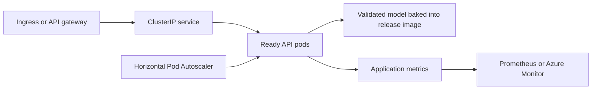

# Kubernetes Model Serving

This directory defines production-style Kubernetes controls for the member-risk FastAPI service. The manifests are designed for an AKS-compatible deployment pattern while remaining usable on other conformant Kubernetes clusters.

The base manifests contain no credentials. The versioned release image contains the model artifact that passed the repository validation job, so the base deployment uses `MODEL_SOURCE=local` and can become ready without an external MLflow client or registry connection.

The managed MLflow alias path remains a separate reference design. It requires an image variant with the MLflow dependency, authorized registry connectivity, workload identity, and an integration test against the target environment before use.

## Manifest inventory

| Manifest | Responsibility |
|---|---|
| `kustomization.yaml` | assembles the complete deployable manifest set |
| `deployment.yaml` | versioned API image, baked validated model, three replicas, zero-unavailable rolling deployment, probes, resources, security context, and topology spread |
| `service.yaml` | internal `ClusterIP` service and named HTTP port |
| `hpa.yaml` | CPU- and memory-based horizontal scaling from 3 to 30 replicas |
| `pdb.yaml` | preserves at least two available replicas during voluntary disruptions |
| `serviceaccount.yaml` | Azure workload-identity integration point without embedded credentials |
| `networkpolicy.yaml` | restricts inbound traffic and limits egress to DNS and approved HTTPS destinations |

## Request path



## Versioned image

The Deployment references:

```text
ghcr.io/mrdata355/hospitality-data-mlops-reference-platform:1.1.0
```

The `release-image` GitHub Actions workflow publishes both the original `v1.1.0` tag and the normalized `1.1.0` semantic-version tag, plus a source-commit tag. The image includes OCI source, version, build date, and source-commit labels, together with build provenance and an SBOM.

For an enterprise release, the deployment process should replace the tag with the immutable image digest generated by the registry.

## Model-loading boundary

### Runnable base path

The checked-in Deployment uses:

```text
MODEL_SOURCE=local
MODEL_ALIAS=Champion
```

The release job rebuilds the deterministic pipeline and tests before the image is published. The Docker build then copies the validated `member_churn_model.joblib` artifact into the non-root image. Readiness fails when that artifact is unavailable or cannot load.

### Managed MLflow extension

The API also supports `MODEL_SOURCE=mlflow`, but that path is not enabled in the base image or base manifests. A managed overlay must provide:

- an image containing the compatible MLflow client
- the approved model URI and alias
- workload identity or another approved short-lived authentication mechanism
- network access to the registry and artifact store
- startup and scoring integration tests in the target environment
- an independent rollback test for the model alias

This separation prevents a reference manifest from selecting a runtime mode that the published image cannot execute.

## Availability controls

### Rolling deployment

```text
replicas: 3
maxUnavailable: 0
maxSurge: 1
minReadySeconds: 10
```

A new revision must become ready before an existing pod is removed from service.

### Probes

| Probe | Endpoint | Purpose |
|---|---|---|
| Startup | `/ready` | allows model initialization before liveness enforcement begins |
| Readiness | `/ready` | removes a pod from traffic when the validated model is unavailable |
| Liveness | `/health` | restarts a process that is no longer responsive |

Readiness and liveness are intentionally separate. A temporarily unready model-serving pod should stop receiving traffic before Kubernetes decides to restart it.

### Disruption and placement

- The PodDisruptionBudget keeps at least two pods available during voluntary maintenance.
- Zone spreading reduces concentration in one availability zone.
- Hostname spreading reduces concentration on one node.
- A graceful pre-stop delay allows endpoint removal before process termination.
- Revision history permits an application rollback independent of a future managed-model rollback.

## Scaling policy

The HPA scales between 3 and 30 replicas using:

- target CPU utilization of 60%
- target memory utilization of 70%
- rapid scale-up policies
- five-minute scale-down stabilization

This is a production-style starting point, not a claim of measured production capacity. Replica limits and thresholds must be tuned using observed request rate, model load time, p95 and p99 latency, error rate, CPU, memory, and downstream dependency behavior.

## Security controls

- fixed non-root UID and GID `10001`
- runtime-default seccomp profile
- privilege escalation disabled
- all Linux capabilities dropped
- read-only root filesystem
- writable `/tmp` supplied through a size-limited `emptyDir`
- workload-identity service account metadata for managed extensions
- no credentials embedded in manifests
- ingress and egress restricted through NetworkPolicy
- CPU and memory requests and limits

Authentication, authorization, rate limiting, TLS termination, and abuse controls are expected at the authorized ingress or API gateway and are not claimed as implemented by these base manifests.

## Manifest rendering

Render the complete manifest set:

```bash
kubectl kustomize k8s/
```

Validate against an authorized cluster:

```bash
kubectl apply --dry-run=server -k k8s/
kubectl diff -k k8s/
```

## Deployment preparation

Before applying the manifests:

1. publish a validated semantic-version image through `release-image`
2. record and pin the immutable registry digest
3. replace `REPLACE_WITH_MANAGED_IDENTITY_CLIENT_ID` when workload identity is required
4. confirm registry pull access
5. confirm ingress namespace labels and approved egress destinations
6. configure metrics collection, dashboards, and alert routes
7. verify rollback permissions and change approval
8. execute staging smoke and controlled load tests

No secret values should be committed to this directory.

## Release verification

After an authorized staging deployment:

```bash
kubectl get deployment,pods,service,hpa,pdb
kubectl rollout status deployment/member-risk-api
kubectl describe hpa member-risk-api
kubectl get events --sort-by=.lastTimestamp
```

A staging release should verify:

- startup and readiness behavior
- `/version` matches the approved image and source commit
- representative score response schema
- model alias and feature metadata
- p95 and p99 latency under controlled load
- error rate and timeout behavior
- scaling response and stabilization
- pod replacement during voluntary disruption
- application rollback to the prior image

## Rollback layers

The runnable base path supports application rollback by restoring the prior Kubernetes image revision. Because the validated model artifact is packaged with the image, this also restores the corresponding local model artifact.

A future managed MLflow overlay should preserve a separate model rollback decision by restoring the prior approved alias version without changing the application image.

## Validation boundary

Pull-request CI builds and serves the Docker image with restricted privileges and executes the API smoke test. The manifests are also checked for release, runtime, availability, and security invariants. A live AKS deployment still requires authorized identities, networking, registry access, gateway controls, monitoring destinations, immutable digest pinning, capacity evidence, and operational approval.
