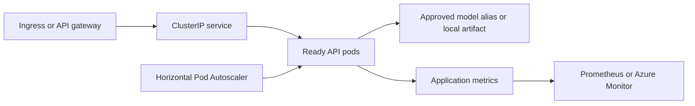

# Kubernetes Model Serving

This directory defines production-style Kubernetes controls for the member-risk FastAPI service. The manifests are designed for an AKS-compatible deployment pattern while remaining vendor-neutral enough for other conformant clusters.

No live registry, identity, model URI, or cloud credential is committed. Placeholders must be supplied only through an authorized deployment process.

## Manifest inventory

| Manifest | Responsibility |
|---|---|
| `deployment.yaml` | immutable API image, three replicas, zero-unavailable rolling deployment, resource controls, probes, security context, topology spread, workload configuration |
| `service.yaml` | internal `ClusterIP` service and named HTTP port |
| `hpa.yaml` | CPU- and memory-based horizontal scaling from 3 to 30 replicas |
| `pdb.yaml` | preserves at least two available replicas during voluntary disruptions |
| `serviceaccount.yaml` | workload-identity integration point without embedded credentials |
| `networkpolicy.yaml` | restricts inbound traffic and limits egress to DNS and approved HTTPS destinations |

## Request path



## Availability controls

### Rolling deployment

The deployment specifies:

```text
replicas: 3
maxUnavailable: 0
maxSurge: 1
minReadySeconds: 10
```

This allows a new revision to become ready before an existing pod is removed from service.

### Probes

| Probe | Endpoint | Purpose |
|---|---|---|
| Startup | `/ready` | allows model initialization before liveness enforcement begins |
| Readiness | `/ready` | removes a pod from traffic when the model is unavailable |
| Liveness | `/health` | restarts a process that is no longer responsive |

Readiness and liveness are intentionally separate. A temporarily unready model-serving pod should stop receiving traffic before Kubernetes decides to restart it.

### Disruption and placement

- The PodDisruptionBudget keeps at least two pods available during voluntary maintenance.
- Zone spreading reduces concentration in one availability zone.
- Hostname spreading reduces concentration on one node.
- A graceful pre-stop delay allows endpoint removal before process termination.

## Scaling policy

The HPA scales between 3 and 30 replicas using:

- target CPU utilization of 60%
- target memory utilization of 70%
- rapid scale-up policies
- five-minute scale-down stabilization

The configuration is a production-style starting point, not a claim of measured production capacity. Replica limits and thresholds should be adjusted using observed request rate, model load time, p95/p99 latency, error rate, CPU, memory, and downstream dependencies.

## Security controls

- non-root execution
- runtime default seccomp profile
- privilege escalation disabled
- all Linux capabilities dropped
- read-only root filesystem
- writable `/tmp` supplied through `emptyDir`
- workload-identity service account placeholder
- no secrets embedded in manifests
- ingress and egress restricted through NetworkPolicy

## Deployment preparation

Before applying the manifests:

1. build and scan an immutable image
2. push the image to an approved registry
3. replace the image reference with a version tag or digest
4. configure workload identity
5. create the model URI secret through the deployment platform
6. confirm ingress namespace labels and network destinations
7. configure metrics collection and alerts
8. verify model registry and network access

## Example validation commands

```bash
kubectl apply --dry-run=server -f k8s/
kubectl diff -f k8s/
```

After an authorized deployment:

```bash
kubectl get deployment,pods,service,hpa,pdb
kubectl rollout status deployment/member-risk-api
kubectl describe hpa member-risk-api
kubectl get events --sort-by=.lastTimestamp
```

## Release verification

A staging release should verify:

- startup and readiness behavior
- representative score response schema
- p95 and p99 latency under controlled load
- error rate and timeout behavior
- scaling response and stabilization
- pod replacement during voluntary disruption
- rollback to the prior image and model alias

## Rollback layers

The serving architecture separates two rollback decisions:

1. **Application rollback:** restore the prior Kubernetes image revision.
2. **Model rollback:** restore the prior approved MLflow model version behind the `Champion` alias.

This separation allows model behavior to be corrected without unnecessarily changing application code, and application failures to be corrected without altering the approved model.

## Target-role evidence

This folder demonstrates container orchestration, availability engineering, health and readiness design, horizontal autoscaling, workload identity, network boundaries, resource governance, observability integration points, and controlled release/rollback behavior.
