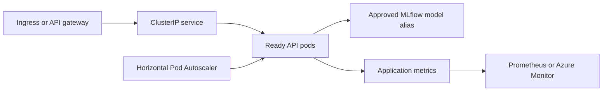

# Kubernetes Model Serving

This directory defines production-style Kubernetes controls for the member-risk FastAPI service. The manifests are designed for an AKS-compatible deployment pattern while remaining usable on other conformant Kubernetes clusters.

The base manifests contain no credentials. The versioned image reference is produced by the repository release workflow; workload identity and the model URI must be supplied through an authorized deployment process.

## Manifest inventory

| Manifest | Responsibility |
|---|---|
| `kustomization.yaml` | assembles the complete deployable manifest set |
| `deployment.yaml` | versioned API image, three replicas, zero-unavailable rolling deployment, probes, resources, security context, topology spread, workload configuration |
| `service.yaml` | internal `ClusterIP` service and named HTTP port |
| `hpa.yaml` | CPU- and memory-based horizontal scaling from 3 to 30 replicas |
| `pdb.yaml` | preserves at least two available replicas during voluntary disruptions |
| `serviceaccount.yaml` | Azure workload-identity integration point without embedded credentials |
| `networkpolicy.yaml` | restricts inbound traffic and limits egress to DNS and approved HTTPS destinations |

## Request path



## Versioned image

The Deployment references:

```text
ghcr.io/mrdata355/hospitality-data-mlops-reference-platform:1.1.0
```

The `release-image` GitHub Actions workflow builds and publishes the image from a validated tag using the repository-provided `GITHUB_TOKEN`. The image includes OCI source, version, build date, and source-commit labels, plus build provenance and an SBOM.

For an enterprise release, the deployment process should replace the tag with the immutable image digest generated by the registry.

## Availability controls

### Rolling deployment

```text
replicas: 3
maxUnavailable: 0
maxSurge: 1
minReadySeconds: 10
```

A new revision must become ready before an existing pod is removed from service.

### Probes

| Probe | Endpoint | Purpose |
|---|---|---|
| Startup | `/ready` | allows model initialization before liveness enforcement begins |
| Readiness | `/ready` | removes a pod from traffic when the approved model is unavailable |
| Liveness | `/health` | restarts a process that is no longer responsive |

Readiness and liveness are intentionally separate. A temporarily unready model-serving pod should stop receiving traffic before Kubernetes decides to restart it.

### Disruption and placement

- The PodDisruptionBudget keeps at least two pods available during voluntary maintenance.
- Zone spreading reduces concentration in one availability zone.
- Hostname spreading reduces concentration on one node.
- A graceful pre-stop delay allows endpoint removal before process termination.
- Revision history permits an application rollback independent of model rollback.

## Scaling policy

The HPA scales between 3 and 30 replicas using:

- target CPU utilization of 60%
- target memory utilization of 70%
- rapid scale-up policies
- five-minute scale-down stabilization

This is a production-style starting point, not a claim of measured production capacity. Replica limits and thresholds must be tuned using observed request rate, model load time, p95/p99 latency, error rate, CPU, memory, and downstream dependency behavior.

## Security controls

- fixed non-root UID and GID `10001`
- runtime-default seccomp profile
- privilege escalation disabled
- all Linux capabilities dropped
- read-only root filesystem
- writable `/tmp` supplied through a size-limited `emptyDir`
- workload-identity service account
- no credentials embedded in manifests
- ingress and egress restricted through NetworkPolicy
- CPU and memory requests and limits

## Manifest rendering

Render the complete manifest set:

```bash
kubectl kustomize k8s/
```

Validate against an authorized cluster:

```bash
kubectl apply --dry-run=server -k k8s/
kubectl diff -k k8s/
```

## Deployment preparation

Before applying the manifests:

1. publish a validated semantic-version image through `release-image`
2. record and pin the immutable registry digest
3. replace `REPLACE_WITH_MANAGED_IDENTITY_CLIENT_ID`
4. create the `member-risk-model-config` secret through the deployment platform
5. verify workload-identity federation and MLflow access
6. confirm registry pull access
7. confirm ingress namespace labels and approved egress destinations
8. configure metrics collection, dashboards, and alert routes
9. verify rollback permissions and change approval

No secret values should be committed to this directory.

## Release verification

After an authorized staging deployment:

```bash
kubectl get deployment,pods,service,hpa,pdb
kubectl rollout status deployment/member-risk-api
kubectl describe hpa member-risk-api
kubectl get events --sort-by=.lastTimestamp
```

A staging release should verify:

- startup and readiness behavior
- `/version` matches the approved image and source commit
- representative score response schema
- model alias and feature metadata
- p95 and p99 latency under controlled load
- error rate and timeout behavior
- scaling response and stabilization
- pod replacement during voluntary disruption
- application rollback to the prior image
- model rollback to the prior approved alias version

## Rollback layers

The serving architecture separates two rollback decisions:

1. **Application rollback:** restore the prior Kubernetes image revision.
2. **Model rollback:** restore the prior approved MLflow model version behind the `Champion` alias.

This separation allows model behavior to be corrected without unnecessarily changing application code, and application failures to be corrected without altering the approved model.

## Validation boundary

Pull-request CI actually builds and serves the Docker image with restricted privileges and executes the API smoke test. These Kubernetes manifests represent the controlled cluster deployment path. A live AKS deployment still requires authorized identities, networking, registry access, MLflow configuration, monitoring destinations, capacity evidence, and operational approval.
