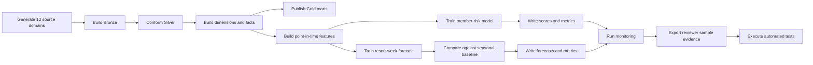

# Local Execution and Evidence Scripts

The scripts directory provides deterministic, credential-free entry points for running, validating, documenting, and resetting the reference platform.

## Script inventory

| Script | Responsibility | Primary outputs |
|---|---|---|
| `run_all.py` | executes the complete local data and ML lifecycle | generated source domains, Bronze/Silver/Gold tables, features, models, metrics, predictions, monitoring, run summary |
| `export_examples.py` | exports compact, public-safe reviewer samples from the current pipeline outputs | `examples/sample_data/`, `examples/sample_outputs/` |
| `clean_outputs.py` | removes generated runtime outputs and recreates empty output directories | clean deterministic replay state |

## Complete local workflow



## Recommended commands

### Install

```bash
make install
```

### Run the platform

```bash
make run
```

Equivalent direct command:

```bash
python scripts/run_all.py
```

### Export reviewer evidence

```bash
make examples
```

Equivalent direct command:

```bash
python scripts/export_examples.py
```

### Run the complete validation path

```bash
make validate
```

`make validate` performs:

```text
run_all.py
→ export_examples.py
→ pytest -q
```

### Clean generated outputs

```bash
make clean
```

## Reproducibility controls

- All synthetic data begins from a fixed random seed.
- Reviewer samples are sorted by stable business keys.
- Direct synthetic contact fields are excluded from committed sample files.
- GitHub Actions rebuilds the examples and fails when they differ from the committed evidence.
- Generated data, model binaries, metrics, and local databases remain outside Git history.

## Expected acceptance evidence

A valid execution should produce:

- 12 generated source domains
- member-risk ROC AUC at or above `0.75`
- forecast WAPE at or below `0.30`
- forecast WAPE no worse than the 52-week seasonal baseline
- passing quality checks
- unique feature and prediction grains
- successful API contract tests

## Credential boundary

These scripts require no Azure, Databricks, MLflow, Kubernetes, or cloud credentials. Managed deployment credentials are intentionally added later through approved identities and secret stores, never through these scripts or committed configuration files.
