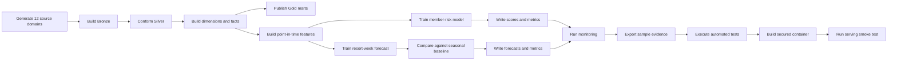

# Local Execution and Evidence Scripts

The scripts directory provides deterministic, credential-free entry points for running, validating, serving, documenting, and resetting the reference platform.

## Script inventory

| Script | Responsibility | Primary outputs |
|---|---|---|
| `run_all.py` | executes the complete local data and ML lifecycle | generated source domains, Bronze/Silver/Gold tables, features, models, metrics, predictions, monitoring, run summary |
| `export_examples.py` | exports compact, public-safe samples from current pipeline outputs | `examples/sample_data/`, `examples/sample_outputs/` |
| `smoke_test_serving.py` | waits for readiness and verifies health, version, model metadata, scoring, request IDs, and metrics | machine-readable serving evidence JSON |
| `clean_outputs.py` | removes generated runtime outputs and recreates empty output directories | clean deterministic replay state |

## Complete validation workflow



## Recommended commands

### Install

```bash
make install
```

### Run the platform

```bash
make run
```

Equivalent direct command:

```bash
python scripts/run_all.py
```

### Export committed evidence

```bash
make examples
```

Equivalent direct command:

```bash
python scripts/export_examples.py
```

### Run the complete data and model validation path

```bash
make validate
```

`make validate` performs:

```text
run_all.py
→ export_examples.py
→ pytest -q
```

### Run the production-style container path

```bash
make container-up
make container-smoke
make container-down
```

The smoke command writes:

```text
artifacts/serving/local-smoke.json
```

The evidence verifies:

- `/health`
- `/ready`
- `/version`
- `/model-info`
- `/score/member-churn`
- `/metrics`
- request-ID propagation
- active feature contract, including `avg_booking_lead_days_12m`

### Run controlled load

```bash
make loadtest
```

### Clean generated outputs

```bash
make clean
```

## Reproducibility controls

- All synthetic data begins from a fixed random seed.
- Sample files are sorted by stable business keys.
- Direct synthetic contact fields are excluded from committed sample files.
- GitHub Actions rebuilds the examples and fails when they differ from committed evidence.
- The serving job downloads only the validated model artifact from the preceding CI job.
- The container image records service version and source commit metadata.
- Generated data, model binaries, metrics, serving evidence, and local databases remain outside Git history.

## Expected acceptance evidence

A valid execution should produce:

- 12 generated source domains
- member-risk ROC AUC at or above `0.75`
- forecast WAPE at or below `0.30`
- forecast WAPE no worse than the 52-week seasonal baseline
- passing quality checks
- unique feature and prediction grains
- successful API contract tests
- a running restricted container that passes end-to-end serving validation

## Credential boundary

These scripts require no Azure, Databricks, MLflow, Kubernetes, registry, or cloud credentials. Managed deployment credentials are intentionally added later through approved identities and secret stores, never through these scripts or committed configuration files.
